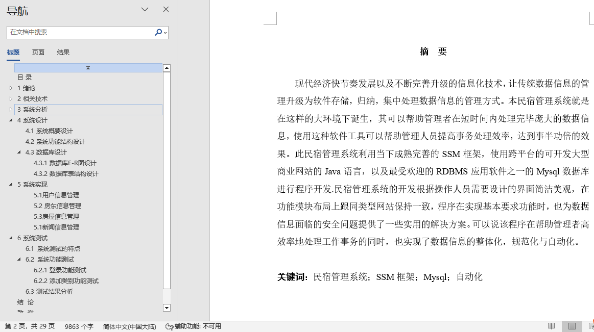
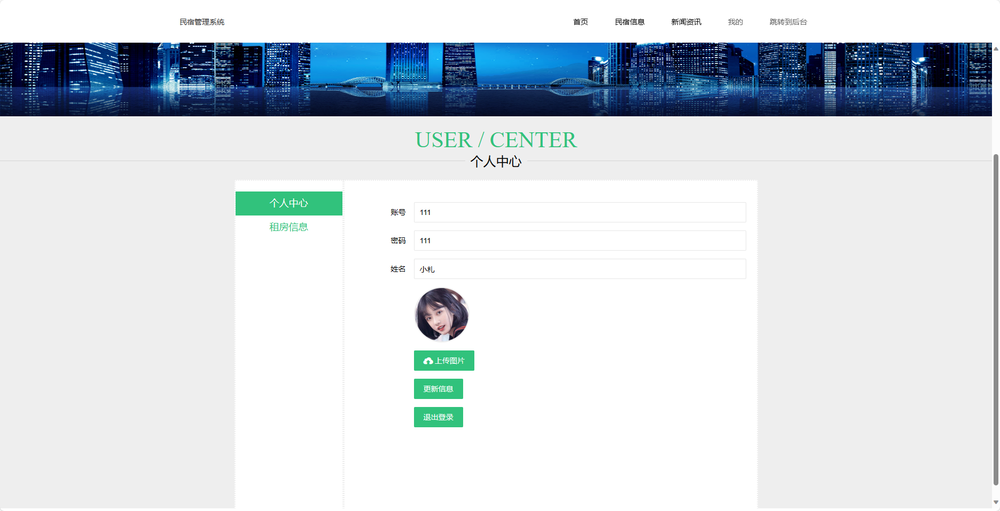
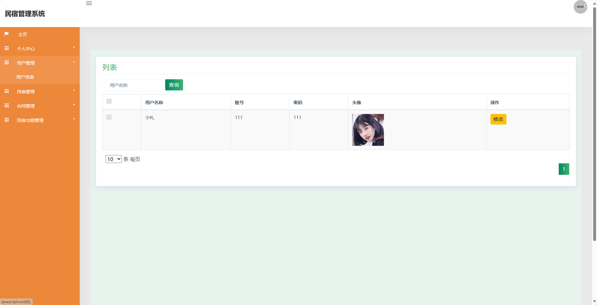
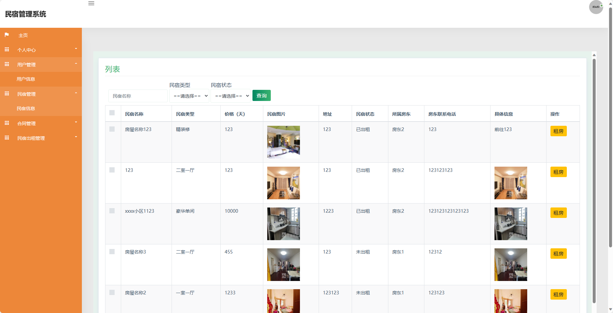
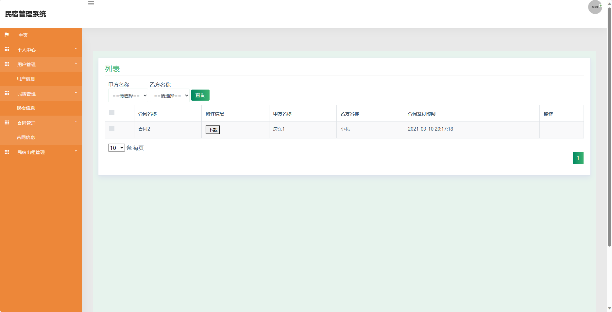
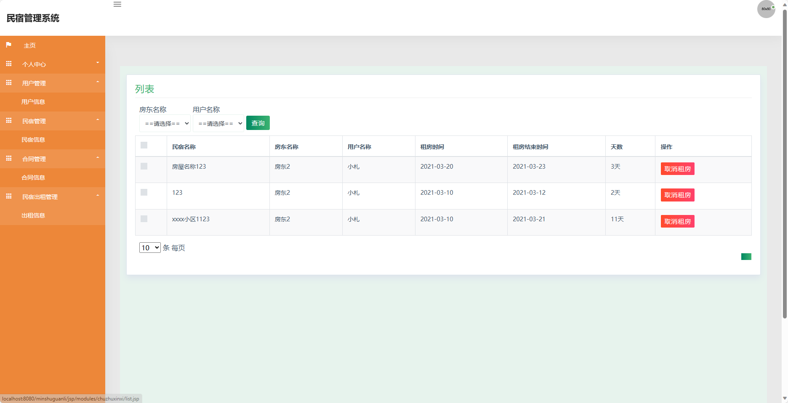
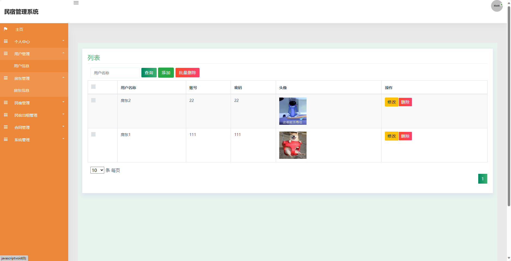
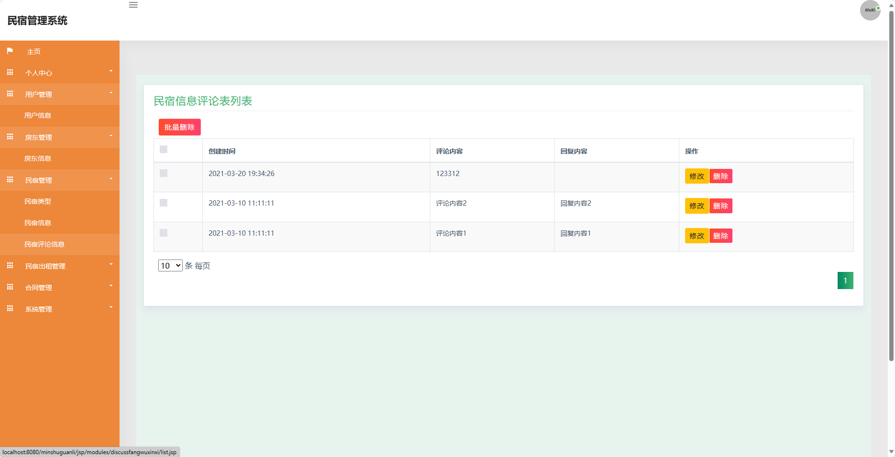

## 基于SSM框架实现的民宿管理系统(程序+报告)

###  获取sql数据库文件: 从戎源码网 (https://armycodes.com/) QQ: 386869957 QQ群: 377586148
###  所有系统地址: (https://github.com/YuLin-Coder/AllProjectCatalog) 
###  所有项目以及源代码本人均调试运行无问题 可支持远程安装部署调试、定制修改、代码讲解

## 项目介绍
基于SSM框架实现的民宿管理系统，系统包含两种角色：管理员、用户,系统分为前台和后台两大模块，主要功能如下。

前台-【用户】：
1. 首页：展示民宿管理系统的基本信息和推荐民宿，包括热门民宿、促销活动等内容，提供快捷入口和搜索功能，方便用户浏览和查找感兴趣的民宿。
2. 民宿信息：用户可以浏览民宿的详细信息，包括民宿名称、价格、图片、地址等，还可以查看其他用户的评价和民宿的设施情况。
3. 新闻资讯：用户可以浏览最新的民宿资讯，包括旅游景点、住宿攻略、民宿优惠等内容，方便用户了解最新的旅行信息。
4. 我的：用户可以登录或注册账号，查看个人信息和收藏记录，还可以进行预订民宿、查看订单等操作，方便用户管理个人信息和旅行记录。

后台-【管理员】：
1. 个人中心：管理员可以查看和管理个人信息，包括用户名、手机号码、员工编号等，还可以修改密码和联系方式。
2. 用户管理：管理员可以管理用户信息，包括查看用户列表、编辑用户信息、冻结用户账号等，还可以查看用户的订单和评价。
3. 房东管理：管理员可以管理房东账号，包括查看房东列表、编辑房东信息、冻结房东账号等，还可以查看房东的民宿和合同信息。
4. 民宿管理：管理员可以管理民宿信息，包括添加、编辑和删除民宿，设置民宿的名称、价格、地址等，还可以管理民宿的设施和图片。
5. 民宿出租管理：管理员可以管理民宿的出租情况，包括查看出租列表、添加出租信息、取消出租等操作，还可以统计民宿的出租率和收益情况。
6. 合同管理：管理员可以管理合同信息，包括查看合同列表、添加合同、终止合同等操作，还可以统计合同的签约情况和收款金额。
7. 系统管理：管理员可以管理系统的基本设置，包括设置网站的名称、LOGO、SEO优化等，还可以配置网站的基本信息和权限控制。

房东：
1. 个人中心：房东可以查看和管理个人信息，包括用户名、手机号码等，还可以修改密码和联系方式。
2. 房东管理：房东可以管理自己的账号信息，包括编辑个人信息、查看房东列表等操作。
3. 民宿管理：房东可以管理自己的民宿信息，包括添加、编辑和删除民宿，设置民宿的名称、价格、地址等，还可以管理民宿的设施和图片。
4. 合同管理：房东可以管理自己的合同信息，包括查看合同列表、添加合同、终止合同等操作，还可以统计合同的签约情况和收款金额。
5. 民宿出租管理：房东可以管理自己民宿的出租情况，包括查看出租列表、添加出租信息、取消出租等操作，还可以统计民宿的出租率和收益情况。

## 项目技术
- 编程语言：Java
- 数据库：MySQL
- 前端技术：JSP、HTML、Jquery、Bootstrap
- 后端技术：Spring、SpringMVC、MyBatis

## 运行环境
- JDK版本：JDK1.8及以上
- 开发工具：IDEA、Ecplise、Myecplise都可以
- 数据库: MySQL5.7及以上

## 运行截图

